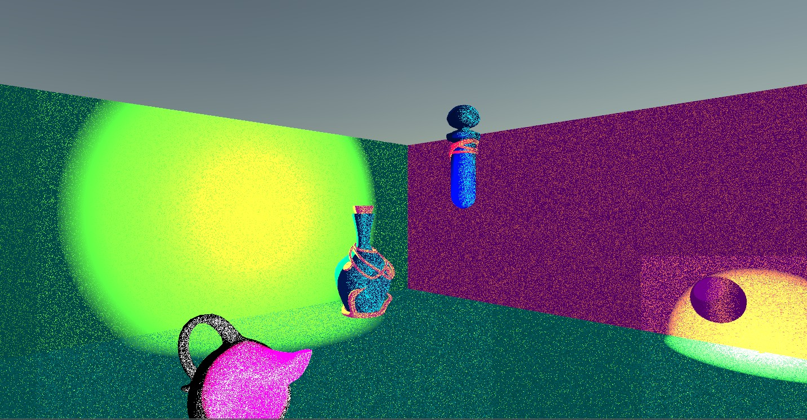
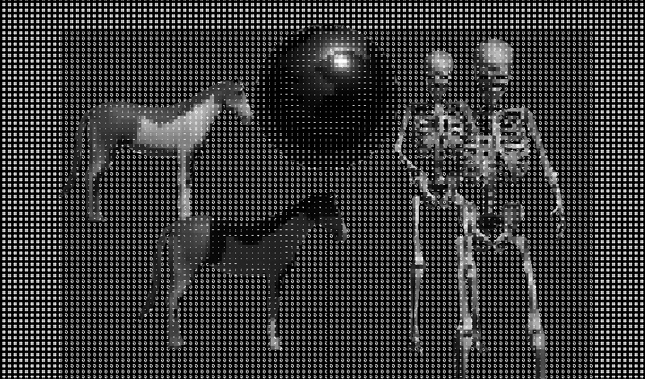

A collection of shaders I've been working on that are by no means efficent or physically plausible just fun.
1) Toon/Noise Surface Shader  
  
2) Pixelated Ascii Prost-Processing Shader  
   in properities you can set the screen size parameter to increase/decrease the affect. In addition, there is a depth threshold controlling where to would start rendering the luminance. I still need to work on this one because I cannot get the edge detection to work!!
   
